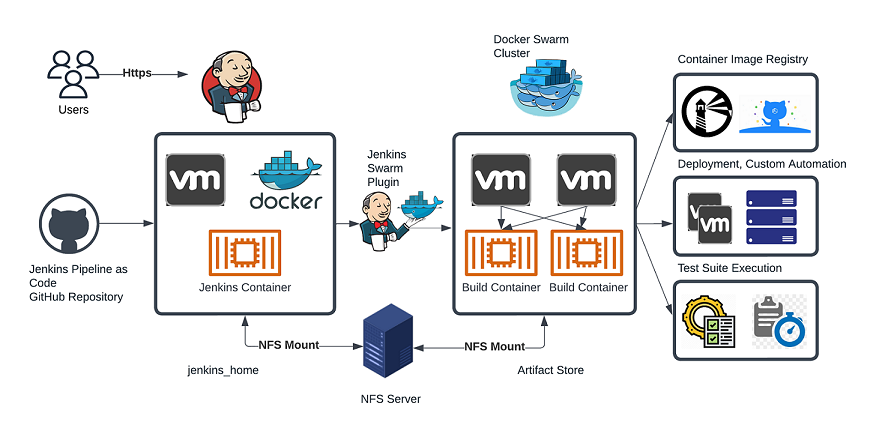

# Jenkins Deployment Architecture 

We use Jenkins as Continuous integration tool. This document explains architecture used to deploy Jenkins and its benefits.

## Overview 

-  Jenkins server is deployed as Docker container. `jenkins_home` is stored outside container through volume mount. Hence actual data is stored on NFS Sever and not on Container or VM
-  Dynamically generated Docker containers are used as Jenkins worker nodes. Docker Swarm is installed on VM cluster and Jenkins Docker Swarm plugin is used to create containers. 
-  Jenkins Container deployment is available as code in docker-compose configuration file. Jenkins can be brought up on any vm with `docker-compose up` in case of VM failure. 
-  Dynamic Containers are used as jump host for Kubernetes and CORTX deployments. We do not need to attach Virtual Machines/HardWate nodes as Jenkins workers in-order to deploy Kubernets/CORTX or any other custom automation on them. Jenkins uses container to connect to provided Virtual Machines/HardWate nodes using user provided credentials. 

## Architecture Diagram

## Tools Used 

* Jenkins 
* Docker
* Docker Swarm
* Vitrual machines on RedHat Virtulization
