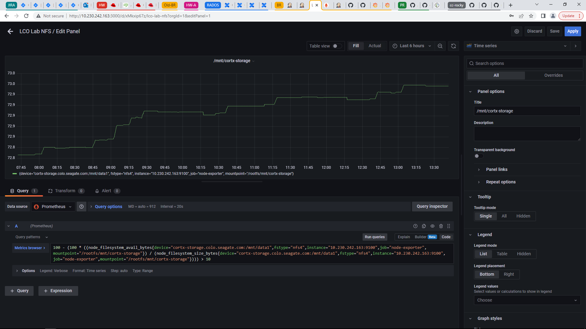
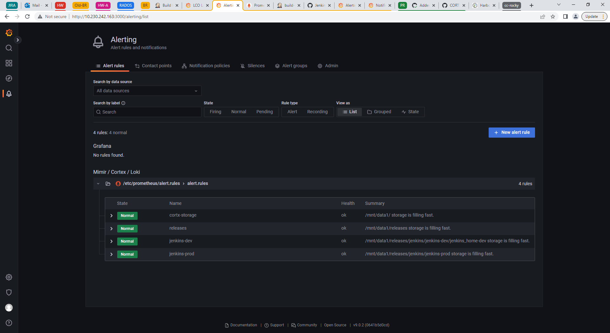
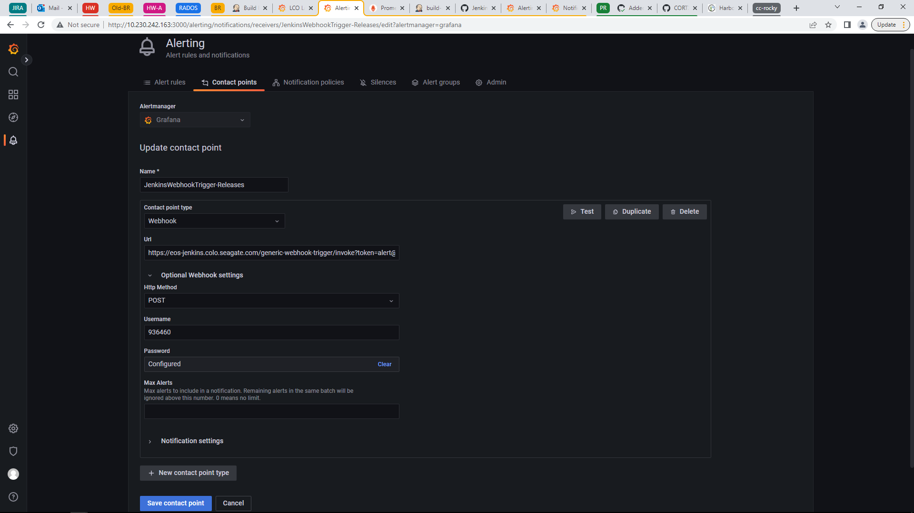
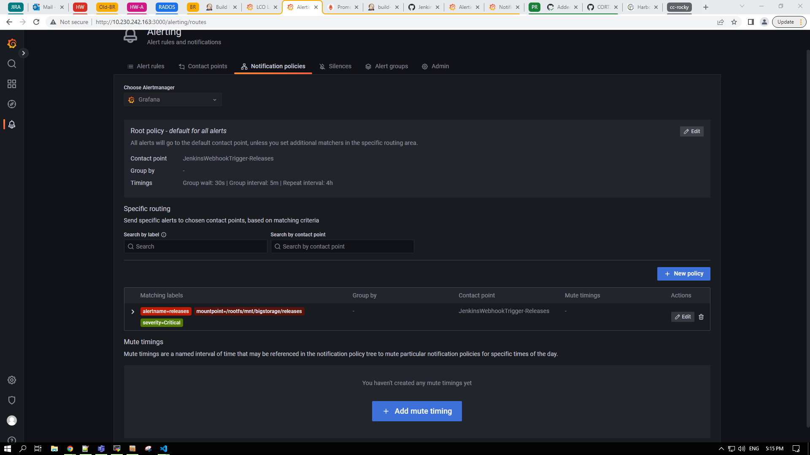
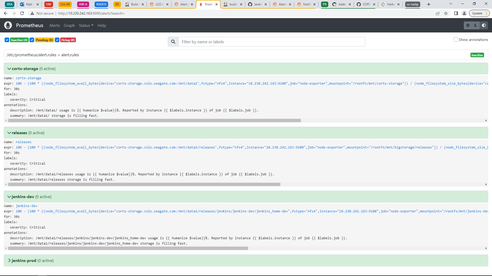
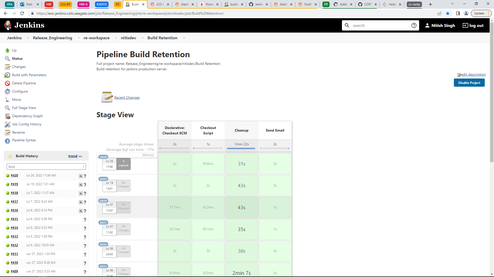

# Build Retention

Any SSC VM with minimum configuration will work. Please add the vm to jenkins production as `build-retention` agent name. All commands have been executed as `root` user.

## Clone the repository

```
git clone https://github.com/Seagate/cortx-re
```

## Install docker & docker-compose

```
curl -fsSL https://get.docker.com -o get-docker.sh
chmod +x get-docker.sh
./get-docker.sh
systemctl enable docker && systemctl restart docker

wget https://github.com/docker/compose/releases/download/v2.6.1/docker-compose-linux-x86_64
chmod +x docker-compose-*
mv docker-compose-linux-x86_64 docker-compose
mv docker-compose /usr/local/bin/
```

## Mount LCO NFS on VM

```
mkdir -p /mnt/cortx-storage /mnt/bigstorage/releases /mnt/jenkins-dev /mnt/jenkins-prod
mount -t nfs4 cortx-storage.colo.seagate.com:/mnt/data1/ /mnt/cortx-storage
mount -t nfs4 cortx-storage.colo.seagate.com:/mnt/data1/releases /mnt/bigstorage/releases
mount -t nfs4 cortx-storage.colo.seagate.com:/mnt/data1/releases/jenkins/jenkins-dev/jenkins_home-dev /mnt/jenkins-dev
mount -t nfs4 cortx-storage.colo.seagate.com:/mnt/data1/releases/jenkins/jenkins-prod /mnt/jenkins-prod
```

## Change files configuration

IP configuration files to change:
1. prometheus.yml
2. alert.rules 

IP configuration needs to be changed to the VM IP through which all services (grafana, prometheus, etc) are accessed. IP should be accessible from outside vm and ports: 3000, 9090 should be allowed through firewall.  

---

Mount configuration files to change:
1. prometheus.yml
2. alert.rules 
3. docker-compose.yml

Mount configuration paths only needs to be changed if above mentioned mountpoints are not followed and LCO NFS is mounted to another location.

## Deploy compose files

The deployment will pull all the requierd docker images from docker hub for grafana, prometheus, cadvisor, node-exporter, alertmanager. 

```
cd cortx-re/scripts/build-retention/monitoring
docker-compose -d up
```

## Destroy deployment

```
cd cortx-re/scripts/build-retention/monitoring
docker-compose down
```

## Backup volume

To move deploymet to another node we need to backup `monitoring_grafana-volume` docker volume so that all configuration of grafana, prometheus, alertmanager, etc are preserved.

```
docker volume ls
```

## Reference screenshots












