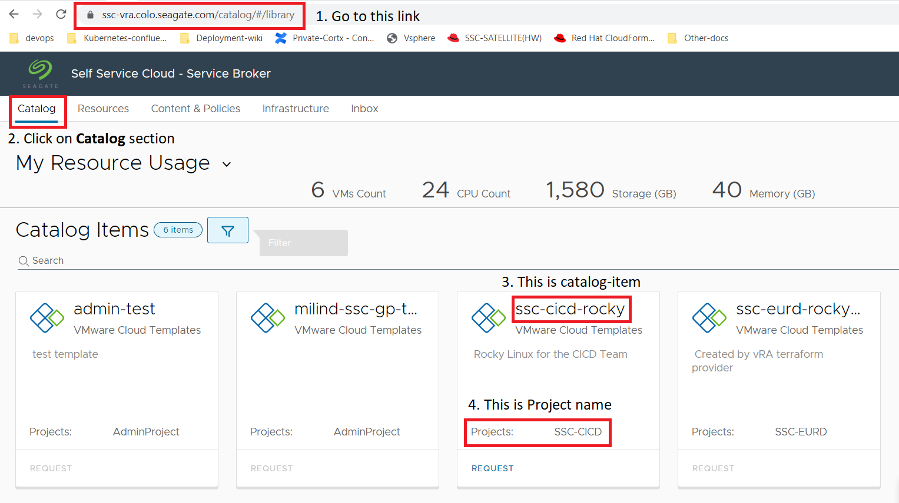

# How to create Deployment/VM resources in VMware vRealize using Terraform

## Pre-requisites
Terraform should be installed on VM environment.

Terraform Installation Reference - https://developer.hashicorp.com/terraform/downloads

## Procedure
* Clone `cortx-re` repository and go to directory `solutions/vmware/terraform`. 
    
    ```
    git clone https://github.com/Seagate/cortx-re && cd $PWD/cortx-re/solutions/vmware/terraform
    ```
* Update `terraform.tfvars` file with required values as per your infrastructure requirements.
  * How to get refresh token - https://seagate-systems.atlassian.net/wiki/spaces/PRIVATECOR/pages/1058210438/Create+VMs+Deployments#1.-Getting-an-API-Token/Refresh-Token
    
  * How to get project name and catalog item -
    
  
    
  * How to get catalog item version - https://seagate-systems.atlassian.net/wiki/spaces/PRIVATECOR/pages/1058210438/Create+VMs+Deployments#2.-List-the-available-versions

    ```
    vi terraform.tfvars
    ```
* Initialize a terraform working directory.  

    ```
    terraform init
    ```
* Validate the terraform configuration files(verify whether a configuration is syntactically valid and internally consistent, regardless of any provided variables or existing state) in a directory.

    ```
    terraform validate
    ```
* Preview and approve the changes that Terraform plans to make to your infrastructure.

    ```
    terraform plan
    ```
* Execute the actions proposed in a Terraform plan

    ```
    terraform apply
    ```
